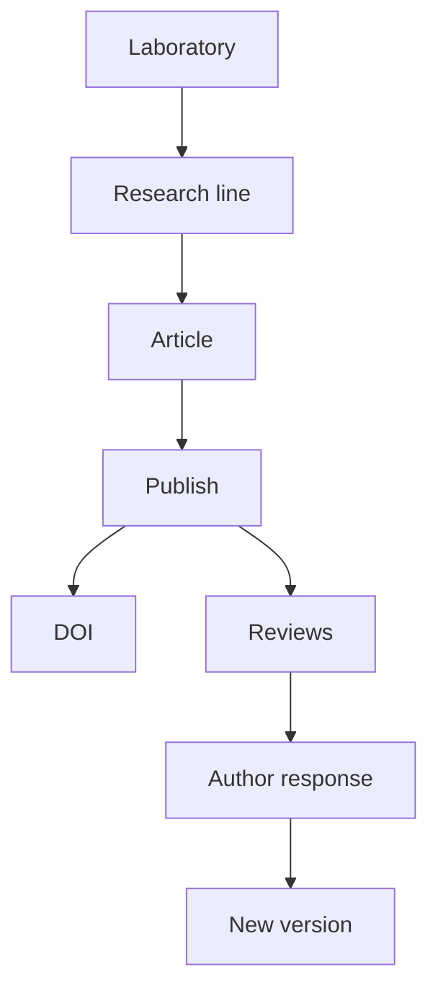

# Labs: Research and Review

## What is Labs?

**Syntropy Labs** is the scientific research pillar. It lets you run the full research cycle on the platform: create a **laboratory** (a digital institution of type `laboratory`), start **research lines** (projects of type `research-line`), write **articles** in MyST or LaTeX, **publish** them (with optional DOI), and receive **open peer review** from the community. Reviews are linked to passages and filtered by reviewer reputation in the article’s subject area.

## How Labs is structured

- **Laboratory** — An institution with type `laboratory`. It has governance, members, and research areas. You create it like any institution; then you create research lines and articles inside it.
- **Research line** — A project of type `research-line`. It represents one research effort: hypothesis, methodology, status, and the artifacts (articles, datasets, experiments) produced. Research lines group articles and data.
- **Article** — An artifact of type `scientific-article`. You write it in the integrated editor (MyST/LaTeX), with real-time rendering. When you **publish**, that version is **immutable** and can receive a DOI (via DataCite/CrossRef). New versions are new publications; the history of versions and reviews is permanent.
- **Review** — Any platform user (except the author) can submit a **review** of a published article. Reviews are public and can be linked to specific passages. The system may **filter** which reviews are shown first by the reviewer’s reputation in the article’s **subject area**. Low-reputation reviews are not removed; they are less prominent. Authors can respond and publish new versions that reference the reviews they addressed.

## Key principles

- **Publish is irreversible** — A published version cannot be edited or deleted. Corrections or updates are new versions.
- **Open peer review** — Anyone can review; reviews are public and tied to the reviewer’s reputation. The reputation system filters visibility; it does not censor.
- **Labs reuses platform primitives** — Laboratory = institution; research line = project; article = artifact. Labs adds scientific context (subject area, methodology, DOI) on top.

## Labs in practice

You create a laboratory, start a research line, write an article in the editor, and publish it. The article gets a DOI and becomes public. Reviewers submit passage-linked reviews; you see them (possibly filtered by reputation), respond, and optionally publish a new version. Your portfolio records publications and reviews; the event bus drives search and recommendations.

## Related concepts

- **[Institutions and Governance](institutions-and-governance.md)** — Laboratories are institutions; governance applies the same way.
- **[Artifacts and the DIP](artifacts-and-dip.md)** — Articles are artifacts; publishing anchors them.

## See Also

- [Labs API](../reference/api/labs.md)
- [Tutorial: Publish a Labs Article](../tutorials/05-publish-labs-article.md)
- [How to submit a Labs review](../how-to/submit-review-labs.md)
