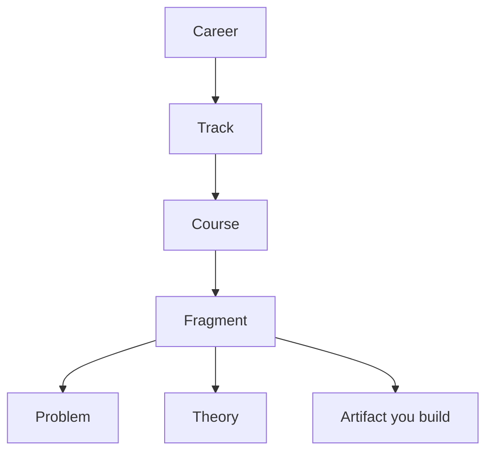

# Learn: Tracks and Fragments

## What is Learn?

**Syntropy Learn** is the education pillar: learning by building. Content is organized around **tracks** — each track is a construction plan for a real **reference project**. You do not just watch or read; every step ends in something you build (an **artifact**). Your progress (fragments completed, artifacts published) is recorded automatically in your portfolio.

## How the hierarchy works

- **Career** — The broadest layer (e.g. “Software development”, “Data science”). It groups tracks by domain.
- **Track** — A learning journey built around one **reference project** (hosted on the Hub). The track has a sequence of **courses**.
- **Course** — A named block of **fragments**; completing a course often unlocks a **collectible** (e.g. a badge or visual item).
- **Fragment** — The smallest unit. Every fragment has three fixed parts: **Problem** (what need or task), **Theory** (concepts or techniques), and **Artifact** (what you build). You read problem and theory, then build the artifact in the embedded IDE or editor and publish it. That completes the fragment.

## Key principles

- **Problem → Theory → Artifact** — This order is fixed. Every fragment ends in something you build; the platform does not allow fragments that skip the artifact.
- **Reference project first** — Track creators define the reference project before writing fragments. The track teaches you to build something equivalent (your **learner project**).
- **Fog of war** — You may see only the next steps (current course and upcoming fragments) until you complete them, so the path is clear but not overwhelming.
- **Portfolio from events** — Completing fragments and publishing artifacts emits events; your portfolio and collectibles update automatically.

## Learn in practice

You pick a career and track (or get a recommendation), open the next fragment, read problem and theory, build the artifact in the IDE, and publish. The fragment is marked complete; the next one unlocks. When you finish a course, you get the course collectible. When you finish the track, you have a complete learner project and a full record in your portfolio.

## Related concepts

- **[Artifacts and the DIP](artifacts-and-dip.md)** — The artifact you build in a fragment is a DIP artifact.
- **[Portfolio and Events](portfolio-and-events.md)** — Fragment completion and collectibles are driven by events.

## See Also

- [Learn API](../reference/api/learn.md)
- [Tutorial: Complete a Learn Track](../tutorials/02-complete-learn-track.md)
- [Tutorial: Onboarding to First Artifact](../tutorials/01-onboarding-first-artifact.md)
