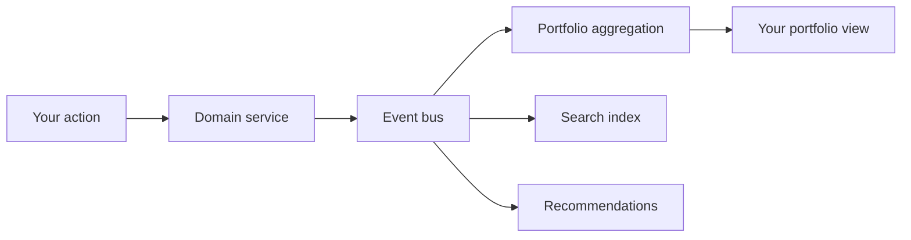

# Portfolio and Events

## What is the portfolio?

Your **portfolio** is the platform’s record of what you have done across Learn, Hub, and Labs: completed fragments, accepted contributions, published articles, sponsorships, and so on. It is **automatic** — you do not edit it by hand. The platform derives it from an **event log**: every meaningful action (e.g. “artifact published”, “contribution accepted”) is recorded as an **event**, and the portfolio aggregation service turns those events into XP, skills, achievements, and collectibles.

## How portfolio and events work

1. **You act** — You publish an artifact, get a contribution accepted, publish an article, or complete a fragment.
2. **Domain emits an event** — The domain service publishes a structured event to the **event bus** (e.g. Kafka). The event has a type, actor, timestamp, and payload (IDs, pillar, etc.).
3. **Event bus delivers** — Subscribers (portfolio aggregation, search index, recommendations, notifications) consume events. They do not call back into your session; they run asynchronously.
4. **Portfolio updates** — The portfolio service updates your record: XP, skill inferences, achievement checks, collectible assembly. When you open your portfolio, you see the result of all events that have been processed so far.

## Key principles

- **Event-driven** — The portfolio is not a form you fill out; it is the consequence of events. If an event is lost, that piece of history is missing, so the event bus is designed for durability and audit.
- **Verifiable** — The ecosystem event log is append-only and tamper-evident (e.g. hash-chained). That supports audit and trust.
- **Cross-pillar** — The same event stream feeds Learn progress, Hub contributions, Labs publications, and sponsorship. One identity, one portfolio.

## Portfolio in practice

When you complete a Learn fragment and publish the artifact, an event is emitted. Your XP and possibly a collectible update. When a maintainer accepts your Hub contribution, another event is emitted and your portfolio reflects the accepted contribution. Recommendations use the same events to suggest issues or articles that match your activity.

## Related concepts

- **[Artifacts and the DIP](artifacts-and-dip.md)** — Publishing artifacts is one of the main sources of events.
- **[Learn: Tracks and Fragments](learn-track-fragment.md)** — Fragment completion and collectibles are part of the portfolio.

## See Also

- [Portfolios, Search, Recommendations API](../reference/api/portfolios-search.md)
- [Tutorial: Onboarding to First Artifact](../tutorials/01-onboarding-first-artifact.md)
